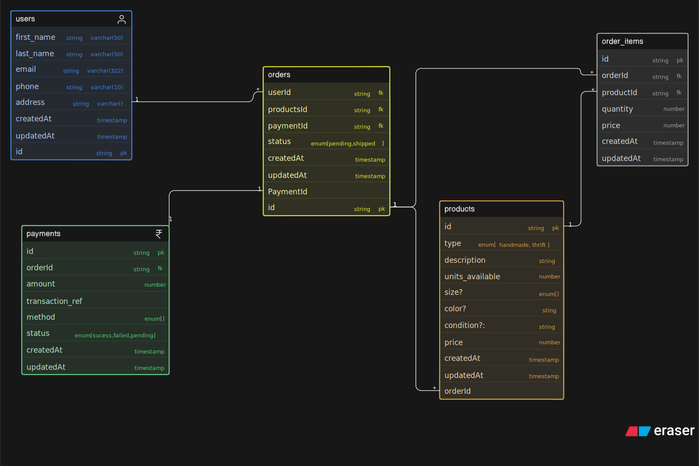

# Thrift and Handmade Store Database Design

## Overview
This project contains an ER diagram for a small store selling thrifted and handmade products. The design supports product management, inventory tracking, customer orders, and payments.

## Design Notes
- A single `products` table is used with a `type` field to distinguish thrift and handmade items.
- An `order_items` table is used to handle the many-to-many relationship between orders and products.
- Payments are linked to orders to avoid redundancy.

## Entities
Users, Products, Orders, Order Items, Payments

## Diagram
