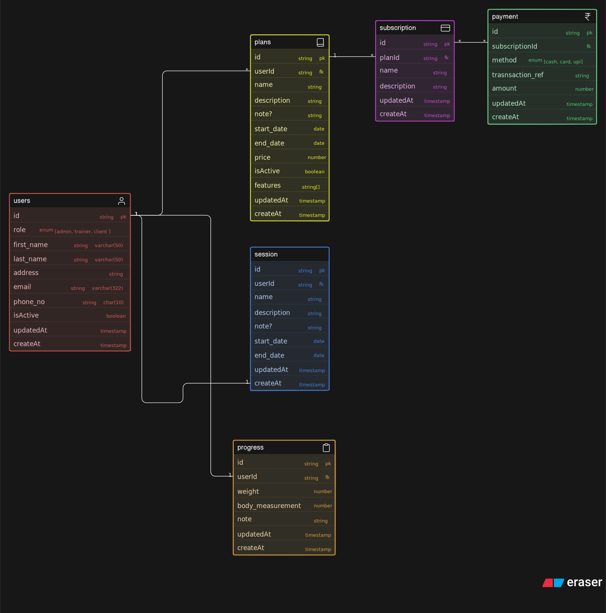

# Fitness Coaching Platform – ER Diagram

## Overview
This project represents the database design for an online fitness coaching platform where trainers manage clients, sell plans, schedule sessions, track progress, and handle subscriptions and payments.

The system supports both short-term consultations and long-term coaching programs, along with structured tracking of client performance and trainer feedback.

---

## Core Entities

### Users
Stores all platform users including admins, trainers, and clients.

### Trainer_Clients
Maps trainers to their assigned clients. This represents the relationship between trainers and clients.

### Plans
Defines coaching programs created by trainers. Plans act as reusable templates with pricing and duration.

### Subscriptions
Represents a client purchasing a plan. Contains lifecycle details such as start date, end date, and status.

### Payments
Tracks transactions made for subscriptions.

### Sessions
Represents scheduled consultations between a trainer and a client.

### Progress
Stores client body metrics such as weight and measurements over time.

### Check_Ins
Represents periodic client updates reviewed by trainers, including feedback.

### Diet_Entries
Stores diet instructions assigned by trainers to clients on a daily basis.

---

## Relationships

- A trainer can manage multiple clients via `trainer_clients`.
- A trainer can create multiple plans.
- A client can subscribe to multiple plans over time.
- A plan can be subscribed to by multiple clients.
- A subscription can have multiple payments.
- A client can have multiple progress records.
- A trainer and client can have multiple sessions.
- A client can submit multiple check-ins reviewed by a trainer.
- A trainer assigns diet entries to clients, optionally linked to a subscription.

---

## Key Design Decisions

- Separation of plans and subscriptions ensures reusability and proper tracking of purchases.
- Progress tracking is independent of users to allow time-based data storage.
- Sessions and check-ins are modeled separately to distinguish between consultations and feedback cycles.
- Diet is treated as a dynamic, client-specific entity rather than a static attribute.
- Trainer-client relationships are handled via a mapping table to support scalability.

---

## Diagram

## Code
[ View ER Code](./code.txt)
