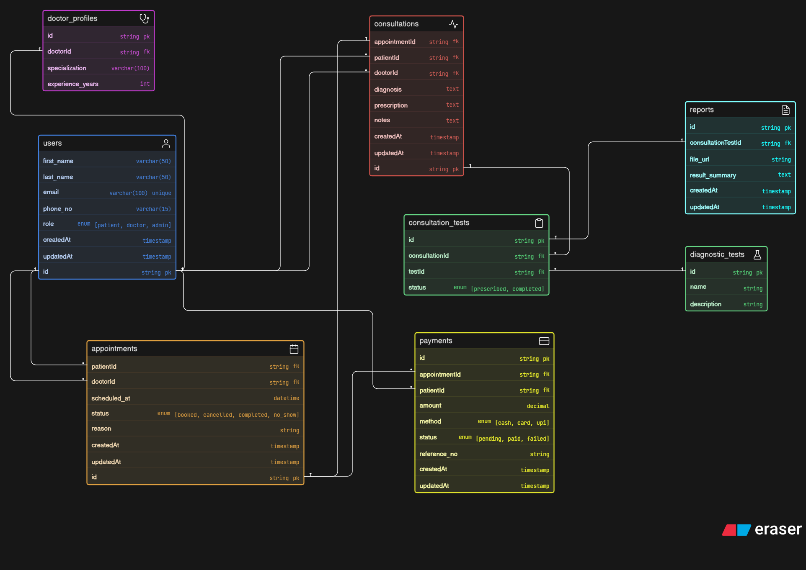

# Clinic Appointment and Diagnostics Platform

## Overview
This project represents a simplified clinic management system. It models how patients interact with doctors through appointments, consultations, diagnostic tests, reports, and payments.

## Workflow
Patient → Appointment → Consultation → Tests → Reports → Payment

## Key Features
- Supports multiple doctors and patients  
- Tracks appointment status (booked, cancelled, completed, no-show)  
- Separates appointment booking from actual consultation  
- Allows multiple diagnostic tests per consultation  
- Reports are linked to specific tests  
- Payments are associated with appointments  

## Diagram

## Code
[ View ER Code](./code.txt)