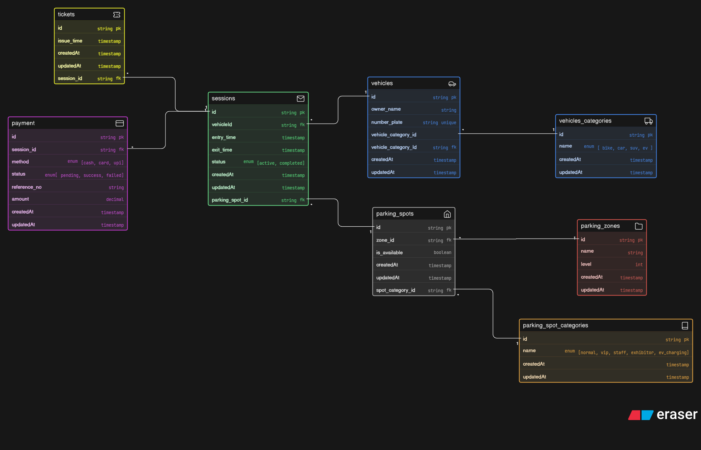

# Comic-Con Parking System - ER Design

## Overview
This system models a multi-zone parking facility designed for large-scale events like Comic-Con. It manages vehicle entry, parking allocation, reserved categories, sessions, tickets, and payments.

## Entities

### Vehicles
Stores information about vehicles entering the parking facility.
- Linked to vehicle categories
- Identified by unique number plate

### Vehicle Categories
Defines types of vehicles such as bike, car, SUV, and EV.

### Parking Zones
Represents different areas or levels in the parking facility.

### Parking Spots
Individual parking units within zones.
- Linked to zones and spot categories
- Tracks availability

### Parking Spot Categories
Defines reserved or special-purpose spots:
- Normal
- VIP
- Staff
- Exhibitor
- EV Charging

### Sessions
Represents a single parking event.
- Tracks entry and exit timestamps
- Links vehicle and parking spot
- Determines active or completed parking

### Tickets
Issued at the time of entry.
- Linked to a parking session

### Payments
Handles payment for each parking session.
- Includes method, status, and amount

## Relationships

- A vehicle belongs to one vehicle category
- A vehicle can have multiple parking sessions
- A parking spot belongs to one zone and one category
- A parking spot can be used in multiple sessions over time
- Each session is linked to one vehicle and one parking spot
- Each session generates one ticket
- Each session has one payment record

## Features

- Supports multiple vehicle entries across different days
- Allows reuse of parking spots across sessions
- Tracks parking availability
- Handles reserved parking categories
- Maintains entry and exit records
- Supports multiple payment methods

## Diagram

## Code
[ View ER Code](./code.txt)