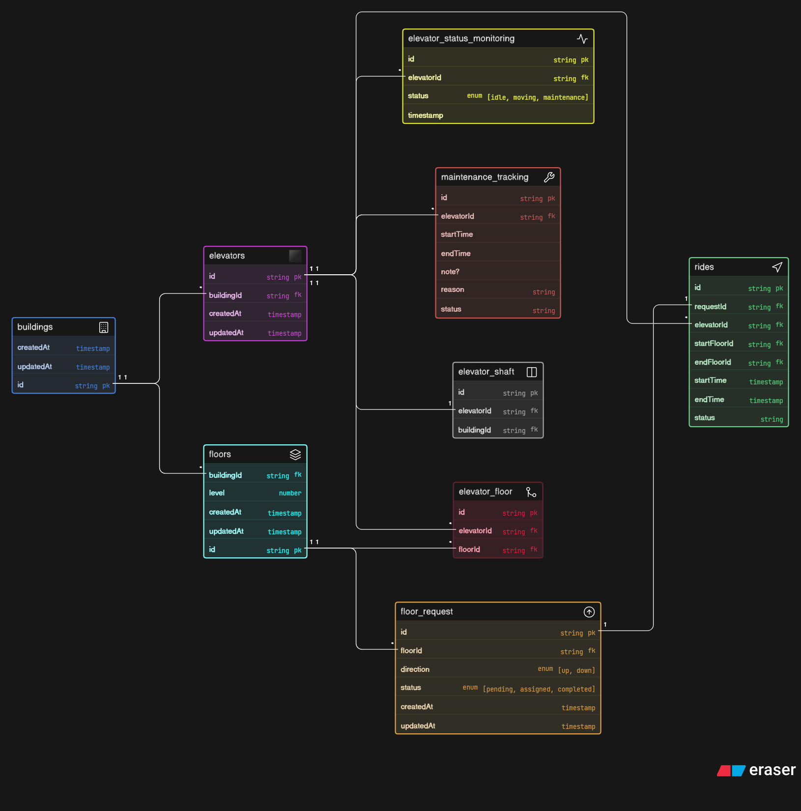

# Smart Elevator Control System (LiftGrid Systems)

## Overview

This project models a scalable backend system for managing intelligent elevator operations across multiple buildings. It supports real-time request handling, elevator allocation, monitoring, and historical tracking.

## Core Features

* Multi-building support
* Multiple elevators per building
* Floor-level request generation
* Smart ride allocation to elevators
* Elevator status tracking (idle, moving, maintenance)
* Maintenance history tracking
* Ride logging for analytics

## System Design Highlights

* Buildings contain multiple floors and elevators
* Elevators can serve multiple floors
* Floors can be served by multiple elevators (M:N via junction table)
* Requests are generated from floors and assigned to elevators
* Each request results in a ride record
* Dynamic data (rides, status) is separated from core entities

## Entities

* Buildings
* Floors
* Elevators
* Elevator Shafts
* Elevator-Floor Mapping
* Floor Requests
* Rides (Trips)
* Elevator Status Monitoring
* Maintenance Tracking

## Key Relationships

* One building → many floors
* One building → many elevators
* Many elevators ↔ many floors
* One floor → many requests
* One request → one ride
* One elevator → many rides, status logs, maintenance records

## Design Principles

* Separation of static and dynamic data
* Use of junction table for many-to-many relationships
* Time-based tracking for status and maintenance
* Scalable structure for high-traffic environments

## Use Cases Supported

* Tracking elevator usage and performance
* Monitoring real-time elevator status
* Identifying pending and completed requests
* Analyzing ride history
* Managing maintenance without data loss

## Diagram

## Code
[ View ER Code](./code.txt)